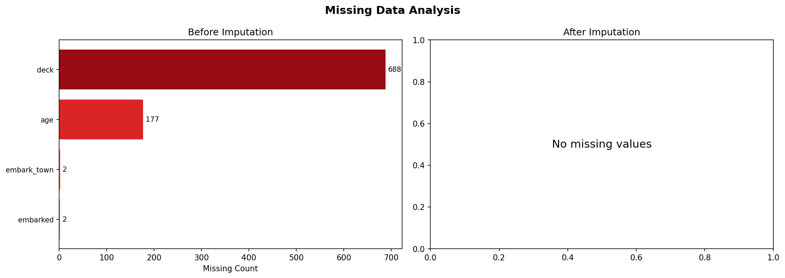
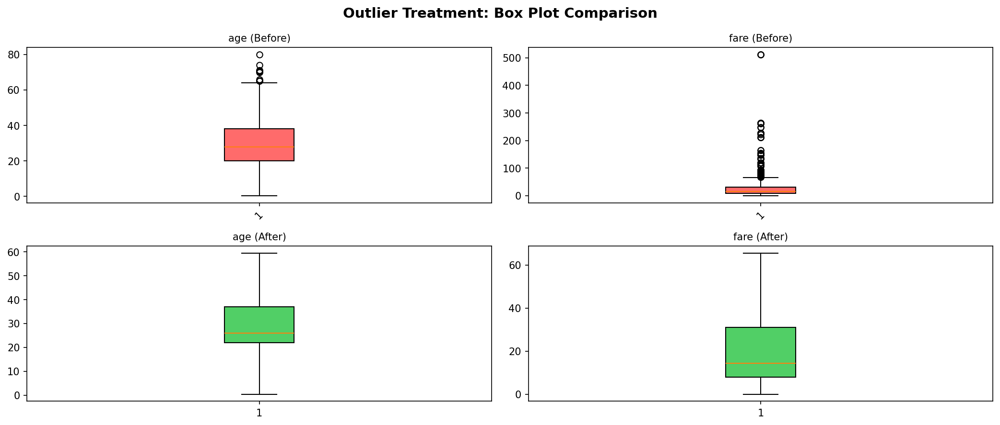
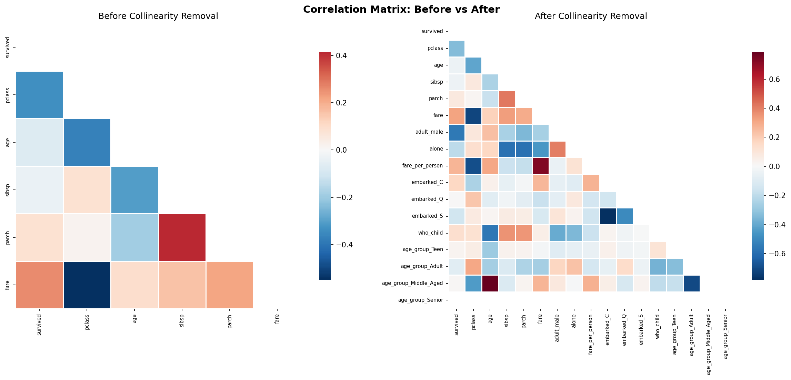
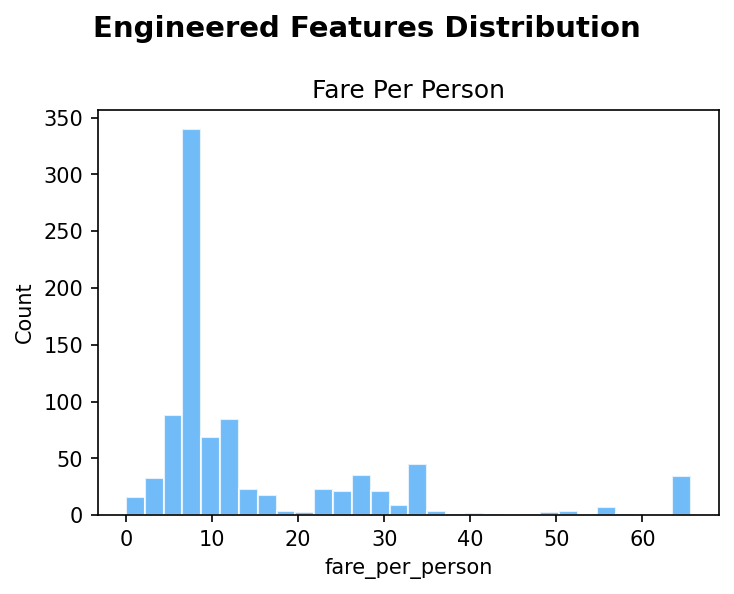
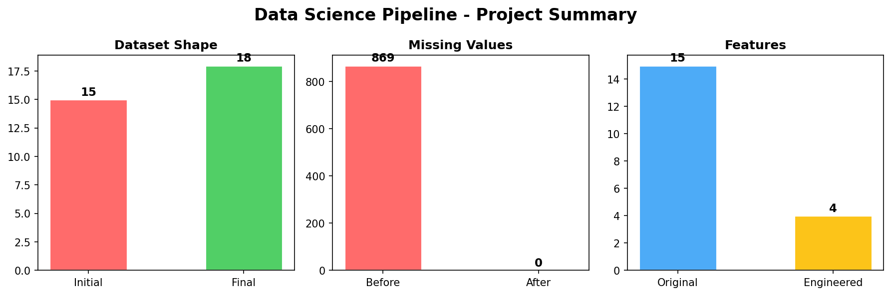

# Enterprise-Grade Data Engineering: Project 1

Advanced EDA, Vectorized Pipelines, and High-Fidelity Feature Stores

## Architecture

This project follows the **Input-Process-Output (IPO)** blueprint for production-ready data pipelines:

```
┌─────────────────┐     ┌─────────────────┐     ┌─────────────────┐
│   PHASE 1       │     │   PHASE 2       │     │   PHASE 3       │
│   INPUT         │ ──> │   PROCESS       │ ──> │   OUTPUT        │
│                 │     │                 │     │                 │
│ • Missing Data  │     │ • Encoding      │     │ • Pandera       │
│   Imputation    │     │ • Vectorization │     │   Schemas       │
│ • Outlier       │     │ • Collinearity  │     │ • Feast         │
│   Treatment     │     │   Eradication   │     │   Feature Store │
│ • IQR/Z-Score   │     │ • OHE / Ordinal │     │ • Data Contract │
└─────────────────┘     └─────────────────┘     └─────────────────┘
```

## Dataset

**Titanic** (seaborn built-in) — 891 rows, 15 columns with:
- Missing values in `age`, `deck`, `embarked`, `embark_town`
- Outliers in `fare`, `age`
- Mixed dtypes (numeric, categorical, boolean)
- Redundant / collinear features

## Pipeline Results

| Metric | Before | After |
|--------|--------|-------|
| Dataset Shape | 891 x 15 | 891 x 18 |
| Missing Values | 869 | **0** |
| Features Engineered | — | 6+ |
| Collinear Features | — | 14 removed |

### New Features Engineered
- `family_size` — family grouping signal
- `is_alone` — solo traveler indicator
- `fare_per_person` — normalized fare
- `age_group` — life-stage categorization
- `title` — social title extraction
- `pclass_sex_interaction` — cross-feature interaction

## Visualizations

| Figure | Description |
|--------|-------------|
|  | Missing value comparison before/after imputation |
|  | Box plots before/after winsorization |
|  | Correlation heatmap before/after collinearity removal |
|  | Distribution of engineered features |
|  | Pipeline impact summary |

## Tech Stack

- **Python 3.12** — Pandas, NumPy, Scikit-learn, SciPy
- **Statistical Methods** — IQR, Z-Score, Winsorization, KNN Imputation
- **Encoding** — One-Hot, Binary, Ordinal
- **Validation** — Schema contracts, statistical boundary checks
- **Visualization** — Matplotlib, Seaborn

## Quick Start

```bash
# Clone the repo
git clone <repo-url>
cd project1

# Run the pipeline
python main.py
```

Or double-click `run.bat` to open in VS Code, then press `Ctrl+Shift+B`.

## Output Artifacts

- `output/cleaned_dataset.csv` — Processed dataset with 0 missing values
- `output/schema_report.csv` — Per-column dtype, missing, and stats
- `output/data_contract.csv` — Formal data contract for downstream consumers
- `output/boundary_warnings.csv` — Features with IQR boundary violations
- `figures/*.png` — Pipeline visualizations

Built with DecodeLabs (2026)
